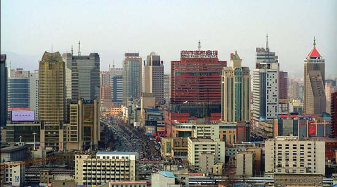
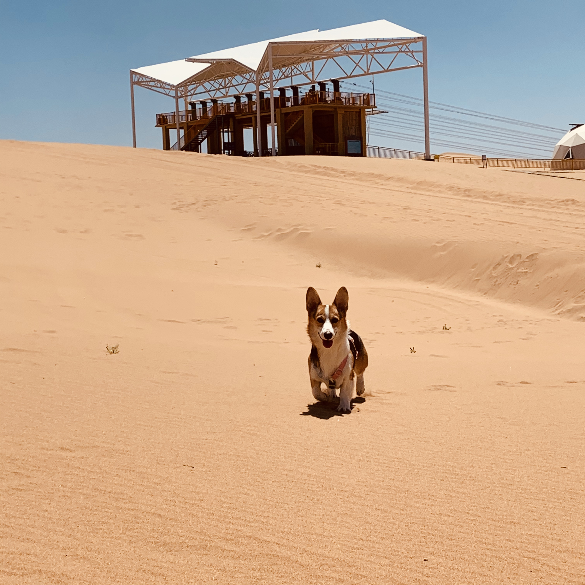

# Welcome to Jiying's website

This is my first website in my life. And in this website, you will see some introduction about myself. Apart from that, I will visualize three dataset from [p8105](https://p8105.com/)

# Welcome to see my hometown - Shijiazhuang, China

This is my hometown -- Shijiazhuang. Shijiazhuang formerly known as Shimen and romanized as Shihkiachwang, is the capital and largest city of North China's Hebei Province. Administratively a prefecture-level city, it is about 266 kilometres southwest of Beijing, and it administers eight districts, two county-level cities, and 12 counties.

# Welcome to see my university - Columbia University, US

Columbia University is a private Ivy League research university in New York City. Established in 1754 on the grounds of Trinity Church in Manhattan, Columbia is the oldest institution of higher education in New York and the fifth-oldest institution of higher learning in the United States.

# Welcome to see my pet - Corgi Biki

I will show my pet's picture to express my love to him. Here is my dog Biki, he is just one year old, and he just like a girl who is so shy but he loves playing with his friends!

# Link to page within the site
* [About me](about.html)

